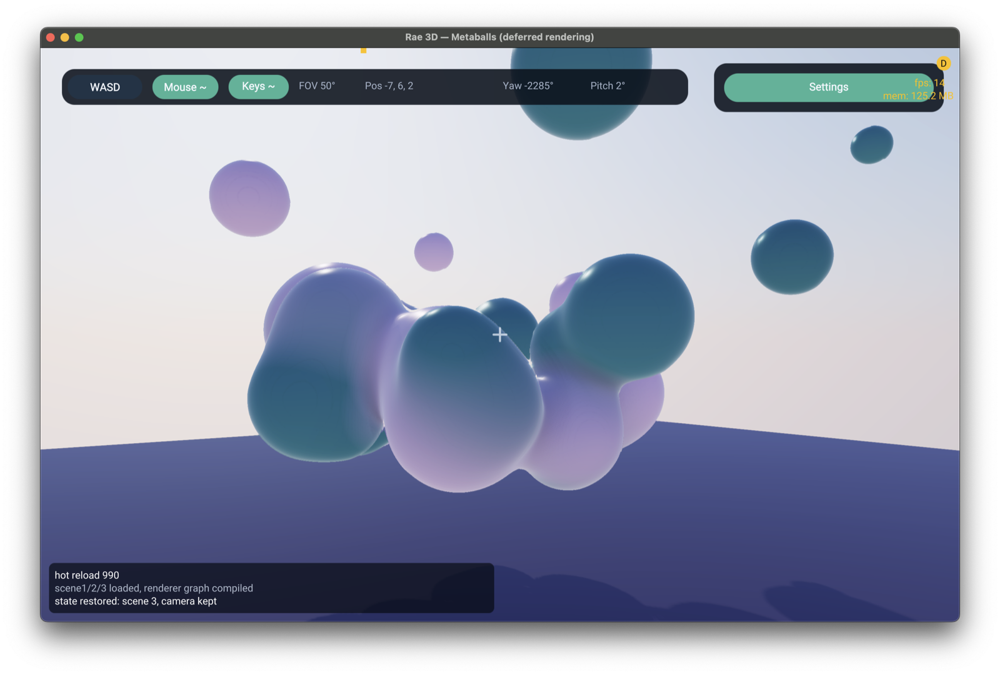
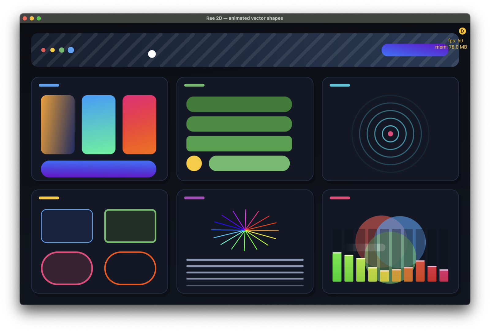
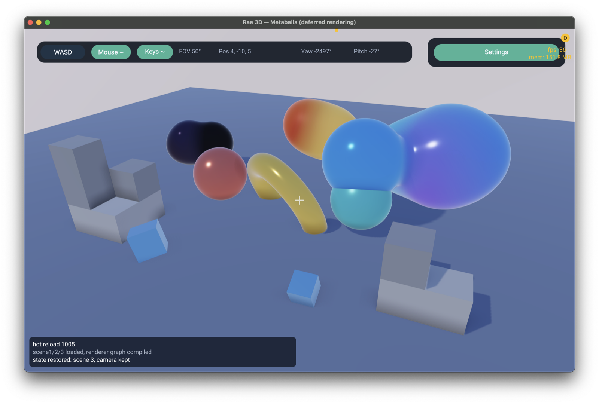
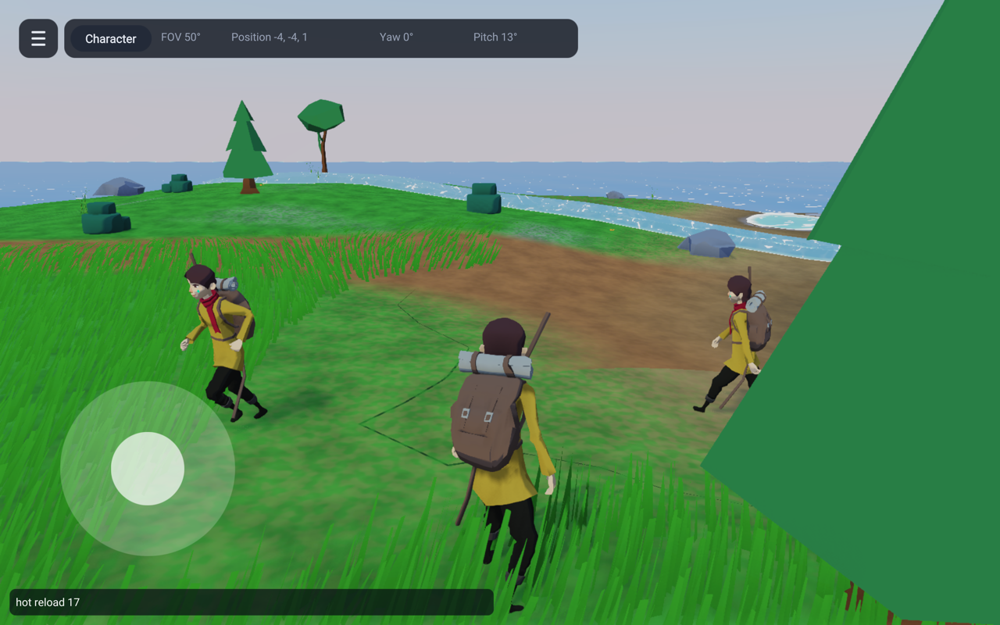
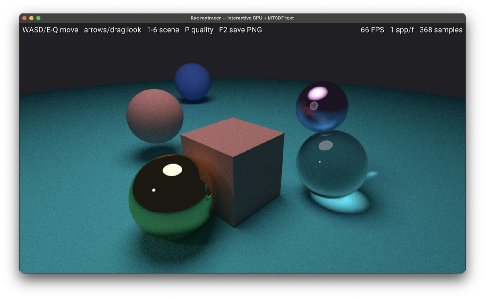
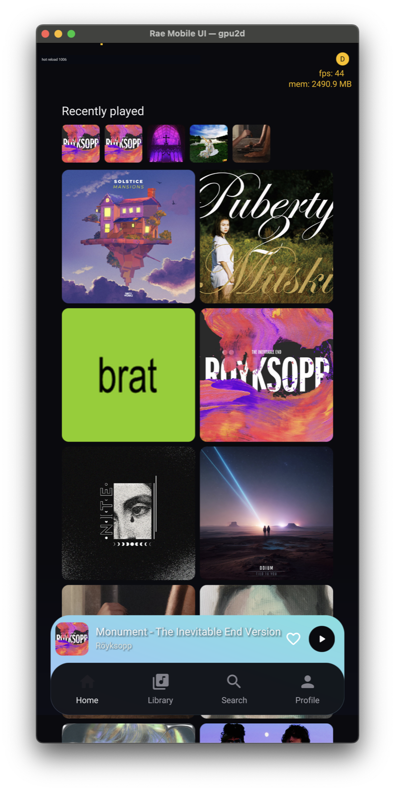
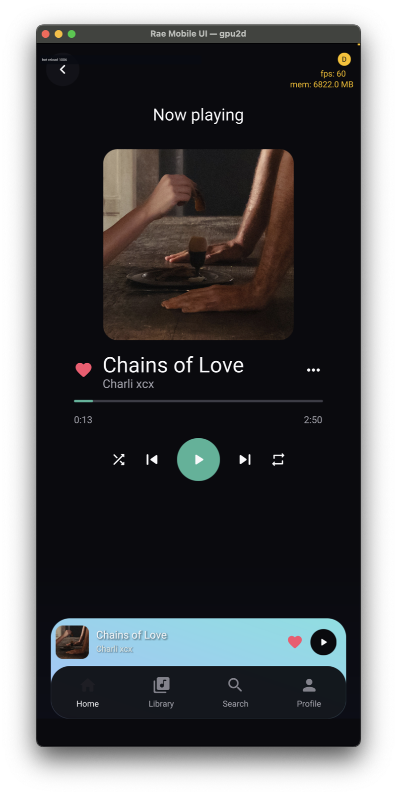
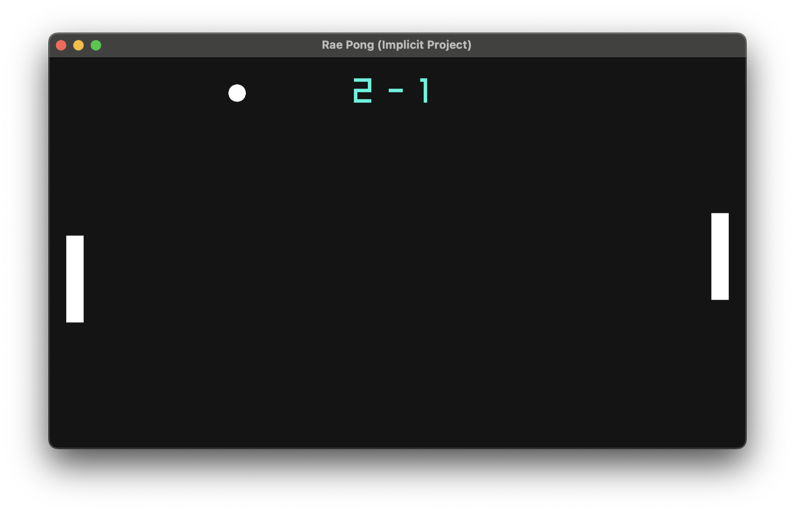
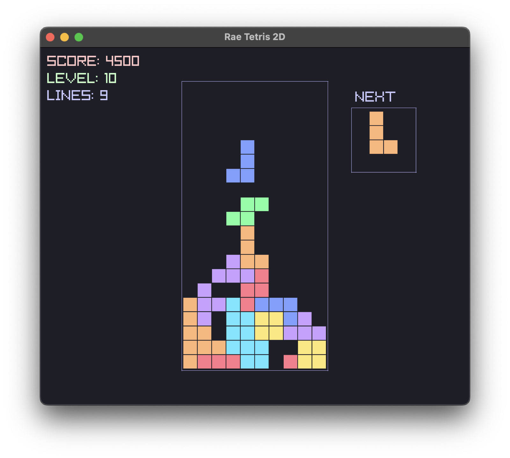

# Rae Programming Language

[](https://xkcd.com/927/)



A minimalistic language for code that humans and AI agents both have to read.

Few concepts, few special cases, and nothing implicit. What a function does to
your data is in its signature; what a call means is at the call site. That suits
a person skimming at midnight and a model editing at scale for the same reason:
neither has to hold the missing half in their head.

This repository is the complete Rae monorepo:

- `compiler/` contains the compiler and C runtime.
- `lib/`, `spec/`, and `docs/` define the language and standard library.
- `examples/` and `benchmarks/` exercise Rae end to end.
- `tools/devtools-web/` contains the Bun/TypeScript development dashboard.
- `QUEUE.md` is the single development queue.

The former `rae-lang-dev` and `rae-devtools-web` repositories were merged with
their complete histories. See [`docs/monorepo.md`](docs/monorepo.md).

## A taste

This is `examples/09_playlist`, verbatim — a type, a list of it, functions
with explicit parameter modes, method-call syntax, an optional result, and
interpolation, all in one file.

```rae
import core

type Track {
  title: String
  seconds: Int
  plays: Int
}

# Parameter modes are always written out. `view` reads, `mod` may write back,
# `own` takes ownership — so a signature tells you what a call does to your data.
func totalSeconds(tracks: view List(Track)) ret Int {
  var total: Int = 0
  loop let track: view Track in tracks {
    total = total + track.seconds
  }
  ret total
}

func formatDuration(seconds: view Int) ret String {
  ret "{seconds / 60}m {seconds % 60}s"
}

# `mod Track` means this function may change the caller's track. It is called
# below as `track.play()` — method-call syntax is sugar for `play(track: track)`.
func play(track: mod Track) {
  track.plays = track.plays + 1
}

# `opt view Track` is a result that is either nothing or a VIEW into an existing
# track — no null, no sentinel, and no copy of the track. The caller handles the
# empty case; `if let` binds the view when there is one.
func longest(tracks: view List(Track)) ret opt view Track {
  if tracks.length is 0 {
    ret none
  }
  # Find the winner by index, so no track is copied, then hand back a view of it.
  var bestIndex: Int = 0
  loop var i: Int = 1, i < tracks.length, ++i {
    if let candidate: view Track => tracks.viewAt(index: i) {
      if let best: view Track => tracks.viewAt(index: bestIndex) {
        if candidate.seconds > best.seconds { bestIndex = i }
      }
    }
  }
  ret tracks.viewAt(index: bestIndex)
}

func main() {
  # `let` because the binding is never reassigned — the list is still mutable
  # through it (adding an element is not rebinding the name).
  let tracks: List(Track) = createList(Track, cap: 3)
  tracks.add(value: Track { title: "Intro", seconds: 95, plays: 0 })
  tracks.add(value: Track { title: "Middle Eight", seconds: 212, plays: 0 })
  tracks.add(value: Track { title: "Outro", seconds: 143, plays: 0 })

  # Arguments are named at the call site, and "{}" is how a value becomes text.
  log("{tracks.length} tracks, {formatDuration(seconds: totalSeconds(tracks: tracks))}")

  loop let track: view Track in tracks {
    log("  {track.title} — {formatDuration(seconds: track.seconds)}")
  }

  # `modAt` hands back a mutable window; `play` writes through it, into the list.
  if let first: mod Track => tracks.modAt(index: 0) {
    first.play()
    first.play()
  }
  if let first: view Track => tracks.viewAt(index: 0) {
    log("{first.title} played {first.plays} times")
  }

  # The optional view, handled with `if let` — `=>` binds it, no copy.
  if let top: view Track => longest(tracks: tracks) {
    log("longest: {top.title} ({formatDuration(seconds: top.seconds)})")
  } else {
    log("no tracks")
  }
}
```

```
3 tracks, 7m 30s
  Intro — 1m 35s
  Middle Eight — 3m 32s
  Outro — 2m 23s
Intro played 2 times
longest: Middle Eight (3m 32s)
```

## Absence, and references

`opt T` says a value may not be there — in the type, not in a convention. There
is no null and no sentinel, so a caller cannot forget the empty case.

```rae
type Library {
  tracks: List(Track)
  current: Track
  playing: Bool
}

# An optional REFERENCE: a view of a track the library owns, or nothing at all.
func nowPlaying(lib: view Library) ret opt view Track {
  if lib.playing is false {
    ret none
  }
  ret view lib.current
}

# `if let` narrows it to a reference for the branch. `=>` binds — required
# here because the optional holds a reference, and `=` never produces a
# shared handle.
if let track: view Track => nowPlaying(lib: view lib) {
  log("playing {track.title} — {formatDuration(seconds: track.seconds)}")
} else {
  log("nothing playing")
}
```

```
playing Middle Eight — 3m 32s
nothing playing
```

An optional reference costs a nullable pointer — the same eight bytes as a plain
one, with no box and no allocation — so `nowPlaying` hands back a window onto the
library's own track rather than a copy of it.

## What the syntax is doing

- **Named arguments, always.** `formatDuration(seconds: total)` rather than
  `formatDuration(total)`. Two arguments of the same type cannot be swapped
  silently, and a call reads without jumping to the declaration.
- **Parameter modes, always.** Every parameter is `view`, `copy`, `mod` or
  `own`; a bare `seconds: Int` is a compile error. "Does this function change my
  value" should never be a thing you have to guess or go and check.
- **`{}` is how a value becomes text.** Interpolation evaluates expressions and
  calls, so printing does not need a formatting mini-language.
- **`=` copies, `=>` binds.** One character tells you whether a line produces an
  independent value or a second name for an existing one — without knowing how
  big the type is or what it holds. `=>` is required wherever the type contains
  `view` or `mod`, and refused everywhere else.

## Refactoring stability: change the type, keep the meaning

In most mainstream languages, what `=` does depends on the type. That makes a
type change a semantic change — in lines that never appear in the diff.

Dart, for example:

```dart
int process(int x) {
  var y = x;      // copy: ints are values
  y = 42;
  return x;       // x is untouched
}
```

Someone later promotes `int` to a class:

```dart
Track process(Track x) {
  var y = x;      // same line — now an ALIAS: classes are references
  y.value = 42;   // mutates the caller's object
  return x;       // x is not what the caller sent
}
```

`var y = x` silently changed from copy to alias. The line didn't change; the
diff doesn't contain it; no call site admits that callers' objects now get
mutated. Java, C#, Python, JavaScript and Kotlin work the same way — primitives
copy, objects alias, and the boundary between the two is the type, not the
code. Swift has the same flip one level up: turn a `struct` into a `class` and
every `let y = x` in the program quietly stops copying.

C and C++ don't have this flip at `=` — assignment copies, and refactoring
`int` to `int*` is loud, because every use site has to change too. C++ has the
same trap at the call boundary instead: change a parameter from `Track` to
`Track&` and every existing call still compiles, unchanged — `process(x)` now
mutates the caller's object and nothing at the call site says so. Rust avoids
the problem at both places: `=` never aliases, borrowing is spelled at the
binding and at the call site (`&mut x`), and when a type change turns a copy
into a move, every later use of the moved-from value is a compile error rather
than a change in behaviour.

In Rae the operator carries the meaning, so the meaning survives the refactor:

```rae
func process(x: view Track) ret Track {
  var y: Track = x     # still a copy — `=` copies, whatever the type
  y.value = 42         # mutates the copy only
  ret x                # x is untouched, same as the Int version
}
```

If aliasing is what you want, you have to say so — and saying so propagates:

```rae
func process(x: mod Track) ret Track {   # the signature must say mod
  let y: mod Track => x                  # `=>` binds; `=` would refuse
  y.value = 42                           # writes to the caller's track
  ret x
}
```

Now every caller reads `process(x: mod track)` — the mutation is admitted at
the signature, at the call site, and at the binding. A read-only window can't
be promoted along the way (`mod Track => x` is an error when `x` is `view`),
and writing through a view is an error, full stop:

```rae
let v: view Track => x
v.value = 42          # ERROR: v is a view
```

So the `Int` → `Track` refactor cannot silently succeed with a changed
meaning. Either the behaviour is identical, or the compiler stops on every
line whose intent has to be restated. For a human that is a safety property.
For an AI agent editing hundreds of files, it is the difference between a type
migration and a bug-injection campaign.

## Memory safety without a borrow checker

Rae is close to memory-safe, and it gets there **without a borrow checker** — no
lifetime annotations, no `'a`, no solver to fight. One rule does most of the
work:

**References don't escape functions.** `view` and `mod` are non-owning
references, and they are *function-scoped*: you cannot store one in a struct,
return one, or otherwise let it outlive the call it is a parameter of. The owner
— a `List(T)`, a `Track`, whatever — lives in some enclosing scope; a reference
borrows it for the duration of one call and no longer. The lifetime **is** the
function.

That single rule removes the largest family of memory bugs by construction:

- **No dangling references.** A `view Track` cannot be kept somewhere the
  `Track` isn't. Since it can't be stored or returned, it cannot outlive the
  value it points into — there is no "reference that survived its owner."
- **No use-after-free across scopes.** A borrow cannot be held across a
  reallocation, a drop, or a container resize that happens in *another* scope,
  because it never reaches another scope.
- **No aliased-mutation surprises.** `=` copies — always, whatever the type
  (see above); aliasing is spelled `=>`, and only where the signature already
  admits `mod`. A read-only `view` can't be promoted to a writer, and writing
  through a `view` is a compile error.

Rust guarantees the same absence of dangling references, but pays for it with a
borrow checker and lifetime annotations — a real, learnable, non-trivial cost.
Rae buys most of that guarantee with a rule you can hold in your head: *a
reference is a parameter, and it dies at the return.* Ownership itself is
explicit — `own` moves a value, the compiler tracks the move and frees at scope
exit, and using a moved-from value is a compile error — so there is no garbage
collector either.

**The honest "almost."** This is not a proof of memory safety, and Rae does not
claim one:

- Within a *single* function you can still mutate a container while a `view`
  into it is live (resize a `List` you hold a `view` of). It is a local,
  visible pattern — one function, in the diff — not action at a distance, but
  the compiler does not stop it today.
- `extern`/FFI and the raw `Ptr` type are unchecked, exactly as in any systems
  language — that is the escape hatch to C and the GPU.
- Cross-thread sharing is a separate story the concurrency model is still
  growing into.

So: minimalistic, and *almost* memory-safe. The common, program-wide failure
modes — dangling references, use-after-free from escaped borrows, silent aliased
mutation — are gone by construction, and what remains is local and legible. For
a human that is a small rule instead of a large system. For an AI agent
generating and refactoring code, it is a model simple enough to reason about
correctly — which is the whole point of Rae.

## Targets

**Compiled** is the default: the compiler emits C and links a native binary.

**Browser WASM** builds the same source into an SDL3 + WebGPU bundle with
Emscripten, or a headless WASI module for programs that only print. 52 of the 67
examples run in a browser.

Built on top, all in Rae except the raw GPU and platform calls:

- **2D renderer** — WebGPU through wgpu-native and SDL3: shapes, MSDF text,
  images, clipping, a design-resolution coordinate system.

  

- **3D renderer** — forward and deferred paths over the same scenes, with PBR
  materials, cascaded shadows, SSAO, TAA, SDF metaballs, glTF loading and
  skinned animation, and a physical sky (Preetham and Hosek-Wilkie).

  
  
  

- **UI** — an ECS whose widgets are entities and whose layout is a `.raescene`
  document, with a theme of palette slots, spacing and text styles.

  <p>
    
    
  </p>

- **Standard library** — 107 modules: containers, strings, JSON, files, maths,
  time, a calendar, crypto, PNG and DEFLATE written in Rae rather than bound.

## Getting started

```sh
make -C compiler                                     # builds compiler/bin/rae
./compiler/bin/rae run examples/01_hello/main.rae    # from the repo root
```

Run examples from the repo root: the ones that load assets resolve their paths
from there.

`rae run` builds and runs; `rae build --target wasm --out app.html …` produces a
browser bundle; `rae watch` rebuilds and restarts on save, and an app using
`lib/hot_reload` keeps its state across the restart. `rae init` scaffolds a
project. `rae format` pretty-prints.

Run the test suite with `make -C compiler test` — 318 cases.

## Devtools Web: the best way to see this

`tools/devtools-web` is the monorepo's local dashboard. It browses every
example, runs each one natively or in the browser with a click, and shows build
health, the test tree and history.

```sh
./setup.sh     # installs Devtools dependencies and builds the compiler
make dev       # http://localhost:3000
```

Start on the **Featured** tab — a cross-section of what the language can do:

| | |
|---|---|
| **Metaballs (deferred rendering)** | the 3D renderer, with a settings panel and a sky that moves with the time of day |
| **3D Renderer — Walker Character** | a skinned, animated glTF character |
| **Mobile UI — GPU2D** | a phone-shaped application at real app scale |
| **2D Renderer — Animated shapes** | the 2D shape pipeline in motion, with a sound-style EQ visualizer |
| **Raytracer — GPU + MTSDF text** | a path tracer on the GPU with a crisp text overlay |
| **Pong** and **Tetris 2D** | complete little games |
| **Playlist** | the taste above, as a runnable program — most of the language, no graphics |
| **Functions and interpolation** | one step past hello world, no graphics |




The two UI examples are worth opening next: `104_ui_hello` is a value and three
buttons — the smallest thing that is still an application — and `105_ui_counter`
is the same idea with a `.raescene` layout, a theme and a list rebuilt from data.

The dashboard runs examples Compiled by default, and the ones that support it
also run in an embedded WebGPU canvas.

## Where to look next

| | |
|---|---|
| `spec/rae.md` | the language spec |
| `docs/` | 72 design notes, including the ownership model and the renderer architecture |
| `examples/` | 63 active programs, from hello world up; retired integrations live under `examples/legacy/` |

## License

MIT — see `LICENSE`.
